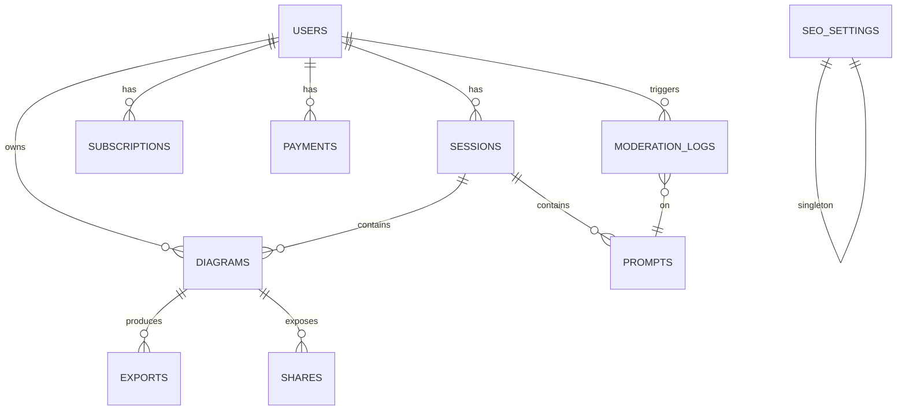

# Diagrammer PRD

## 0) 한눈 요약

* **비회원(게스트)**: LLM → Mermaid/vis.js 리드온리, PNG Export
* **무료 회원**: Mermaid/vis.js → React Flow 변환 편집, 세션 2개 저장, PNG/PPTX
* **유료 회원**: 무제한 세션/검색/공유(뷰), Google Slides Export
* **관리자(Admin)**: 회원/세션/결제/콘텐츠/캐시/SEO/보안 관리 (FastAPI Admin)

렌더링/편집 엔진 규칙

* **Mermaid.js**: 플로우/시퀀스/단순 구조(<100 노드)
* **vis.js**: 네트워크/계층/대규모(>100), 500+ 노드 성능 안전장치
* **회원 편집**: Mermaid/vis.js → **React Flow 객체** 변환 후 편집

---

## 1) 화면·메뉴 체계 (재확인)

### 1.1 사용자 메뉴 (요약)

* **게스트**: 홈, 다이어그램(리드온리), PNG, 로그인/가입
* **무료**: 홈, 세션(최대2), React Flow 편집, PNG/PPTX, 설정
* **유료**: 홈, 세션(무제한/검색), React Flow 고급, PNG/PPTX/Slides, 공유, 설정

### 1.2 Admin 메뉴 (요약)

* 대시보드, 회원, 세션, 결제, 콘텐츠(비속어/신고), 캐시/성능, SEO, 보안/로그

---

## 2) 접근성·반응형·설정

* **모바일/태블릿**: 탭 전환(입력/코드/히스토리 ↔ 뷰), 유료 Export/공유는 Bottom Sheet
* **접근성**: ARIA, 컬러블라인드 팔레트, Export 시 **대체 텍스트(프롬프트 요약)** 삽입
* **설정 페이지**: LLM 선택(Gemini/Local), 언어/통화(i18n/CURRENCY), 스타일 프리셋, 접근성 옵션
* **프로필**: 사용자 정보/구독/결제 상태

---

## 3) 기술 스택·라이브러리

* **프론트**: Next.js(App Router), React Flow, Mermaid.js, vis-network, shadcn/ui(+Radix), Tailwind, DaisyUI/MagicUI/Aceternity UI, Tailwind Variants
* **백엔드**: FastAPI, FastAPI-Users(또는 자체 OAuth2/JWT), FastAPI Admin, SQLAlchemy+Alembic, Redis, Celery
* **DB**: PostgreSQL(JSONB), (선택) ElasticSearch
* **인증/결제/SEO/분석**: Auth.js, Stripe/토스, next-seo, next-sitemap, umami/Plausible
* **Export**: html-to-image, python-pptx, Google Slides API
* **콘텐츠 안전**: profanity-check / Perspective API

---

## 4) 단계별 개발 로드맵 + DB 스키마 초안

> 마이그레이션은 **단계별 추가** 중심으로 설계. 스키마 변경은 최소화하고, JSONB로 유연성 확보.

### 단계 1: **코어(MVP)** – 게스트 체험 (약 3주)

**기능**

* 프롬프트 → LLM → Mermaid/vis.js 리드온리 렌더링
* PNG Export
* 반응형 레이아웃

**핵심 테이블**

```sql
-- visitors: 익명(비회원) 세션 추적(쿠키/디바이스 핑거프린트)
CREATE TABLE visitors (
  id BIGSERIAL PRIMARY KEY,
  anon_id TEXT UNIQUE NOT NULL,
  created_at TIMESTAMPTZ DEFAULT now()
);

-- diagrams: 다이어그램 원천 코드 + 메타 (게스트도 저장 가능: TTL 캐시성 보관)
CREATE TABLE diagrams (
  id BIGSERIAL PRIMARY KEY,
  visitor_id BIGINT REFERENCES visitors(id) ON DELETE SET NULL,
  engine TEXT CHECK (engine IN ('mermaid','visjs')) NOT NULL,
  code TEXT NOT NULL,
  render_type TEXT CHECK (render_type IN ('readonly')) DEFAULT 'readonly',
  prompt TEXT,
  meta JSONB DEFAULT '{}'::jsonb,            -- node/edge count, layout hints 등
  ttl_expire_at TIMESTAMPTZ,                 -- 게스트 보관 만료
  created_at TIMESTAMPTZ DEFAULT now()
);

-- exports: PNG 결과 이력(필요 시 S3 key만 저장)
CREATE TABLE exports (
  id BIGSERIAL PRIMARY KEY,
  diagram_id BIGINT REFERENCES diagrams(id) ON DELETE CASCADE,
  format TEXT CHECK (format IN ('png')) NOT NULL,
  storage_key TEXT,                          -- 파일 경로/키
  created_at TIMESTAMPTZ DEFAULT now()
);

CREATE INDEX ON diagrams USING GIN (meta);
```

**비고**

* 게스트 데이터는 TTL 만료(예: 24\~72시간). 정식 회원 전환 시 승격(마이그레이션) 가능.

---

### 단계 2: **무료 회원** (약 5주)

**기능**

* Auth(로그인/가입)
* Mermaid/vis.js → **React Flow 객체** 변환 후 편집
* **세션 2개** 저장(코드+프롬프트 히스토리)
* PPTX Export
* 프로필/설정 페이지

**추가/변경 테이블**

```sql
-- users: 기본 회원
CREATE TABLE users (
  id BIGSERIAL PRIMARY KEY,
  email CITEXT UNIQUE NOT NULL,
  password_hash TEXT,                        -- 소셜 로그인만 쓸 경우 NULL 허용
  name TEXT,
  locale TEXT DEFAULT 'ko',
  currency TEXT DEFAULT 'KRW',
  role TEXT CHECK (role IN ('user','admin')) DEFAULT 'user',
  created_at TIMESTAMPTZ DEFAULT now(),
  updated_at TIMESTAMPTZ DEFAULT now()
);

-- sessions: 사용자별 작업 단위(히스토리+다이어그램 묶음)
CREATE TABLE sessions (
  id BIGSERIAL PRIMARY KEY,
  user_id BIGINT REFERENCES users(id) ON DELETE CASCADE,
  title TEXT,
  status TEXT CHECK (status IN ('active','archived')) DEFAULT 'active',
  created_at TIMESTAMPTZ DEFAULT now(),
  updated_at TIMESTAMPTZ DEFAULT now()
);

-- prompts: 프롬프트 히스토리
CREATE TABLE prompts (
  id BIGSERIAL PRIMARY KEY,
  session_id BIGINT REFERENCES sessions(id) ON DELETE CASCADE,
  content TEXT NOT NULL,
  llm_provider TEXT,                         -- 'gemini' | 'local' 등
  llm_params JSONB DEFAULT '{}'::jsonb,
  created_at TIMESTAMPTZ DEFAULT now()
);

-- diagrams (확장): 회원 소유, 편집 지원
ALTER TABLE diagrams
  ADD COLUMN user_id BIGINT REFERENCES users(id) ON DELETE SET NULL,
  ADD COLUMN session_id BIGINT REFERENCES sessions(id) ON DELETE CASCADE,
  ADD COLUMN render_type TEXT CHECK (render_type IN ('readonly','reactflow')) DEFAULT 'readonly',
  ADD COLUMN rf_graph JSONB;                 -- React Flow 객체 그래프(회원 편집용)

-- exports 확장: PPTX 지원
ALTER TABLE exports
  ADD COLUMN format TEXT CHECK (format IN ('png','pptx')) NOT NULL;
```

**비즈니스 로직**

* **세션 수 제한(2개)**: 애플리케이션 레벨 + DB 제약(트리거)로 이중 방어 가능
* 변환 파이프라인: `code (mermaid/visjs) → rf_graph(JSONB)` 저장

---

### 단계 3: **유료 회원** (약 6주)

**기능**

* **무제한 세션** 저장
* **검색**(프롬프트/코드/노드 라벨)
* Google Slides Export
* **공유 링크(뷰 전용)** + CTA
* Stripe/토스 구독 연동

**추가/변경 테이블**

```sql
-- subscriptions: 구독 상태
CREATE TABLE subscriptions (
  id BIGSERIAL PRIMARY KEY,
  user_id BIGINT REFERENCES users(id) ON DELETE CASCADE,
  provider TEXT CHECK (provider IN ('stripe','toss')) NOT NULL,
  plan TEXT CHECK (plan IN ('free','pro')) NOT NULL,
  status TEXT CHECK (status IN ('active','canceled','past_due')) NOT NULL,
  current_period_end TIMESTAMPTZ,
  created_at TIMESTAMPTZ DEFAULT now(),
  updated_at TIMESTAMPTZ DEFAULT now()
);

-- invoices/payments: 결제 이력(간략)
CREATE TABLE payments (
  id BIGSERIAL PRIMARY KEY,
  user_id BIGINT REFERENCES users(id) ON DELETE CASCADE,
  provider TEXT, external_id TEXT, amount_cents INT, currency TEXT,
  status TEXT, paid_at TIMESTAMPTZ, created_at TIMESTAMPTZ DEFAULT now()
);

-- shares: 공유 링크(뷰 전용)
CREATE TABLE shares (
  id BIGSERIAL PRIMARY KEY,
  diagram_id BIGINT REFERENCES diagrams(id) ON DELETE CASCADE,
  token TEXT UNIQUE NOT NULL,                -- URL 토큰
  expire_at TIMESTAMPTZ,
  created_at TIMESTAMPTZ DEFAULT now()
);

-- exports 확장: Google Slides
ALTER TABLE exports
  ADD COLUMN format TEXT CHECK (format IN ('png','pptx','gslides')) NOT NULL;

-- 검색 최적화 인덱스 (Postgres FTS + json path)
CREATE MATERIALIZED VIEW search_index AS
SELECT
  d.id AS diagram_id,
  d.user_id,
  setweight(to_tsvector('simple', coalesce(d.prompt,'')), 'B') ||
  setweight(to_tsvector('simple', coalesce(d.code,'')), 'A') AS tsv
FROM diagrams d;

CREATE INDEX ON search_index USING GIN (tsv);
```

**비즈니스 로직**

* 검색은 **유료 전용** 활성화
* 공유 링크는 **Mermaid/vis.js 리드온리 뷰**에 맞춰 성능/보안 최적화

---

### 단계 4: **Admin 패널** (약 4주)

**기능**

* 회원/세션/결제/콘텐츠/캐시/SEO/보안/로그 관리
* 관리자 MFA

**추가/변경 테이블**

```sql
-- moderation: 비속어/혐오 로그 & 신고 처리
CREATE TABLE moderation_logs (
  id BIGSERIAL PRIMARY KEY,
  user_id BIGINT REFERENCES users(id) ON DELETE SET NULL,
  session_id BIGINT REFERENCES sessions(id) ON DELETE SET NULL,
  prompt_id BIGINT REFERENCES prompts(id) ON DELETE SET NULL,
  type TEXT CHECK (type IN ('profanity','hate','report')) NOT NULL,
  raw_text TEXT NOT NULL,
  score JSONB,                               -- API 응답 점수
  action TEXT CHECK (action IN ('none','warn','delete','ban')) DEFAULT 'none',
  created_at TIMESTAMPTZ DEFAULT now()
);

-- system_logs: API/에러/LLM 호출 로그 (샤딩/보존기간 정책 권장)
CREATE TABLE system_logs (
  id BIGSERIAL PRIMARY KEY,
  level TEXT CHECK (level IN ('INFO','WARN','ERROR')) NOT NULL,
  source TEXT,                                -- 'llm','export','auth','admin' 등
  message TEXT,
  context JSONB,
  created_at TIMESTAMPTZ DEFAULT now()
);

-- seo_settings: 전역 SEO 설정
CREATE TABLE seo_settings (
  id SMALLINT PRIMARY KEY DEFAULT 1,
  meta JSONB NOT NULL,                       -- title, og, default desc 등
  robots TEXT,
  sitemap_url TEXT,
  hreflang JSONB,
  updated_at TIMESTAMPTZ DEFAULT now()
);

-- cache_admin: 캐시/성능 관리 스냅샷
CREATE TABLE cache_admin (
  id BIGSERIAL PRIMARY KEY,
  kind TEXT,                                  -- 'redis','llm_quota'
  metrics JSONB,
  created_at TIMESTAMPTZ DEFAULT now()
);
```

**운영**

* **FastAPI Admin**으로 users/sessions/diagrams/prompts/exports/subscriptions/payments/moderation\_logs/system\_logs/seo\_settings 조작
* Redis 초기화, LLM 에러 모니터링, 신고 처리 워크플로

---

## 5) ER 개요 다이어그램 (Mermaid)



---

## 6) 인덱싱·성능·보안 정책(요약)

* **인덱스**: `diagrams(meta JSONB GIN)`, `search_index(tsv GIN)`, FK 인덱스
* **보존**: 게스트 TTL 만료, system\_logs 보존기간(예: 30\~90일), exports 파일 수명 정책
* **성능**: 500+ 노드 vis.js fallback, React Flow 캔버스 가상화 옵션, Celery로 Export/Slides 비동기 처리
* **보안**: 전 구간 HTTPS, JWT(짧은 수명) + Refresh, 관리자 MFA, 공유 토큰 만료

---

## 7) QA·릴리즈 전략

* **단계별 e2e 테스트**: 게스트 → 무료 → 유료 → Admin
* **마이그레이션**: Alembic 단계별 스크립트, 다운그레이드 경로 확인
* **롤백**: 주요 테이블 백업 스냅샷, 피처 플래그로 점진 오픈

---

## 8) 서비스 Hook (재확인)

* 게스트: “말했더니 차트가 바로 나와!”
* 무료: “드래그·저장까지 된다 → 쓸만하다”
* 유료: “검색·Slides·공유까지 → 업무가 빨라진다”
* Admin: “운영/회원/SEO/보안까지 한 곳에서”

---

