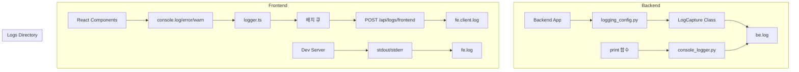

# 디버그 로깅 시스템 구현 가이드

## 개요

이 문서는 풀스택 애플리케이션에서 백엔드와 프론트엔드의 모든 로그를 중앙화된 파일 시스템에 기록하는 로깅 시스템의 구현 방법을 설명합니다. 이 가이드는 다른 프로젝트에서도 동일한 로깅 시스템을 구현할 수 있도록 일반화되어 작성되었습니다.

## 목차

1. [시스템 아키텍처](#시스템-아키텍처)
2. [백엔드 로깅 구현](#백엔드-로깅-구현)
3. [프론트엔드 로깅 구현](#프론트엔드-로깅-구현)
4. [로그 파일 구조](#로그-파일-구조)
5. [구현 예시](#구현-예시)
6. [모니터링 및 분석](#모니터링-및-분석)
7. [프로덕션 고려사항](#프로덕션-고려사항)

---

## 시스템 아키텍처

### 전체 구조

```
프로젝트 루트/
├── apps/
│   ├── backend/                # 백엔드 애플리케이션
│   │   ├── logging_config.py   # 백엔드 로깅 설정
│   │   ├── console_logger.py   # print() 함수 오버라이드
│   │   └── main.py             # 로깅 초기화
│   ├── frontend/               # 프론트엔드 애플리케이션
│   │   ├── lib/
│   │   │   ├── logger.ts       # 프론트엔드 로거 클래스
│   │   │   └── frontend-logger.ts  # 콘솔 오버라이드
│   │   ├── components/
│   │   │   └── ClientLogger.tsx    # 클라이언트 로거 초기화
│   │   ├── app/
│   │   │   ├── layout.tsx      # 로거 컴포넌트 마운트
│   │   │   └── api/
│   │   │       └── logs/
│   │   │           └── frontend/
│   │   │               └── route.ts  # 프론트엔드 로그 수신 API
│   │   └── package.json        # 로그 리다이렉션 스크립트
│   └── logs/                   # 중앙화된 로그 디렉토리
│       ├── be.log              # 백엔드 로그
│       ├── fe.log              # 프론트엔드 빌드/실행 로그
│       └── fe.client.log       # 프론트엔드 클라이언트 로그
```

### 로깅 플로우



---

## 백엔드 로깅 구현

### 1. 로깅 설정 클래스

백엔드에서 모든 로그를 파일로 캡처하는 핵심 클래스입니다.

```python
# logging_config.py
import logging
import sys
from pathlib import Path
from typing import Optional

class LogCapture:
    """모든 로그를 파일로 캡처하는 클래스"""
    
    def __init__(self, log_file: str = "app.log", log_dir: str = "../logs"):
        self.log_dir = Path(log_dir)
        self.log_file = self.log_dir / log_file
        self.logger: Optional[logging.Logger] = None
        
    def setup(self):
        """로깅 시스템 초기화"""
        # 로그 디렉토리 생성
        self.log_dir.mkdir(exist_ok=True)
        
        # 로거 설정
        self.logger = logging.getLogger("app")
        self.logger.setLevel(logging.DEBUG)
        
        # 파일 핸들러 설정
        file_handler = logging.FileHandler(self.log_file, encoding='utf-8')
        file_handler.setLevel(logging.DEBUG)
        
        # 콘솔 핸들러 설정 (선택사항)
        console_handler = logging.StreamHandler(sys.stdout)
        console_handler.setLevel(logging.INFO)
        
        # 포맷터 설정
        formatter = logging.Formatter(
            '[%(levelname)s] %(asctime)s - %(name)s - %(message)s',
            datefmt='%Y-%m-%dT%H:%M:%S.%fZ'
        )
        
        file_handler.setFormatter(formatter)
        console_handler.setFormatter(formatter)
        
        # 핸들러 추가
        self.logger.addHandler(file_handler)
        self.logger.addHandler(console_handler)
        
        return self.logger
    
    def get_logger(self):
        """로거 인스턴스 반환"""
        if not self.logger:
            return self.setup()
        return self.logger
```

### 2. print() 함수 오버라이드

기존 print() 함수 호출도 로그 파일에 기록하도록 오버라이드합니다.

```python
# console_logger.py
import builtins
from typing import Any

class ConsoleLogger:
    """print() 함수를 오버라이드하여 로그 파일에도 기록"""
    
    def __init__(self, logger):
        self.logger = logger
        self.original_print = builtins.print
        
    def setup(self):
        """print() 함수 오버라이드 설정"""
        builtins.print = self._custom_print
        
    def _custom_print(self, *args, **kwargs):
        """커스텀 print 함수"""
        # 원본 print 동작 유지
        self.original_print(*args, **kwargs)
        
        # 로그 파일에도 기록
        message = ' '.join(str(arg) for arg in args)
        if message.strip():  # 빈 메시지 제외
            self.logger.info(f"PRINT: {message}")
    
    def restore(self):
        """원본 print 함수 복원"""
        builtins.print = self.original_print
```

### 3. 백엔드 애플리케이션 초기화

메인 애플리케이션에서 로깅 시스템을 초기화합니다.

```python
# main.py (FastAPI 예시)
from fastapi import FastAPI
from logging_config import LogCapture
from console_logger import ConsoleLogger

# 로깅 시스템 초기화
log_capture = LogCapture(log_file="be.log")
logger = log_capture.setup()

# print() 오버라이드 설정
console_logger = ConsoleLogger(logger)
console_logger.setup()

# FastAPI 앱 생성
app = FastAPI(title="My App")

@app.on_event("startup")
async def startup_event():
    logger.info("Application startup")
    print("Server starting...")  # 이것도 로그 파일에 기록됨

@app.get("/")
async def root():
    logger.info("Root endpoint accessed")
    return {"message": "Hello World"}
```

---

## 프론트엔드 로깅 구현

### 1. 프론트엔드 로거 클래스

클라이언트 사이드 로그를 서버로 전송하는 로거 클래스입니다.

```typescript
// lib/logger.ts
interface LogEntry {
  level: 'debug' | 'info' | 'warn' | 'error'
  message: string
  timestamp: string
  url?: string
  userAgent?: string
}

class FrontendLogger {
  private queue: LogEntry[] = []
  private batchSize = 10
  private flushInterval = 5000 // 5초
  private endpoint = '/api/logs/frontend'
  
  constructor() {
    this.startBatchFlush()
  }
  
  private createLogEntry(level: LogEntry['level'], message: string): LogEntry {
    return {
      level,
      message,
      timestamp: new Date().toISOString(),
      url: typeof window !== 'undefined' ? window.location.href : undefined,
      userAgent: typeof navigator !== 'undefined' ? navigator.userAgent : undefined
    }
  }
  
  debug(message: string) {
    this.addToQueue(this.createLogEntry('debug', message))
  }
  
  info(message: string) {
    this.addToQueue(this.createLogEntry('info', message))
  }
  
  warn(message: string) {
    this.addToQueue(this.createLogEntry('warn', message))
  }
  
  error(message: string) {
    this.addToQueue(this.createLogEntry('error', message))
  }
  
  private addToQueue(entry: LogEntry) {
    this.queue.push(entry)
    
    if (this.queue.length >= this.batchSize) {
      this.flush()
    }
  }
  
  private startBatchFlush() {
    setInterval(() => {
      if (this.queue.length > 0) {
        this.flush()
      }
    }, this.flushInterval)
  }
  
  private async flush() {
    if (this.queue.length === 0) return
    
    const logs = [...this.queue]
    this.queue = []
    
    try {
      await fetch(this.endpoint, {
        method: 'POST',
        headers: {
          'Content-Type': 'application/json'
        },
        body: JSON.stringify({ logs })
      })
    } catch (error) {
      // 로그 전송 실패 시 콘솔에만 출력
      console.error('Failed to send logs:', error)
    }
  }
}

export const frontendLogger = new FrontendLogger()
```

### 2. 콘솔 함수 오버라이드

기존 console.log, console.error 등을 오버라이드하여 자동으로 로그를 수집합니다.

```typescript
// lib/frontend-logger.ts
import { frontendLogger } from './logger'

class ConsoleOverride {
  private originalConsole = {
    log: console.log,
    info: console.info,
    warn: console.warn,
    error: console.error,
    debug: console.debug
  }
  
  setup() {
    console.log = (...args) => {
      this.originalConsole.log(...args)
      frontendLogger.info(this.formatMessage(args))
    }
    
    console.info = (...args) => {
      this.originalConsole.info(...args)
      frontendLogger.info(this.formatMessage(args))
    }
    
    console.warn = (...args) => {
      this.originalConsole.warn(...args)
      frontendLogger.warn(this.formatMessage(args))
    }
    
    console.error = (...args) => {
      this.originalConsole.error(...args)
      frontendLogger.error(this.formatMessage(args))
    }
    
    console.debug = (...args) => {
      this.originalConsole.debug(...args)
      frontendLogger.debug(this.formatMessage(args))
    }
  }
  
  private formatMessage(args: any[]): string {
    return args.map(arg => {
      if (typeof arg === 'object') {
        try {
          return JSON.stringify(arg, null, 2)
        } catch {
          return String(arg)
        }
      }
      return String(arg)
    }).join(' ')
  }
  
  restore() {
    Object.assign(console, this.originalConsole)
  }
}

export const consoleOverride = new ConsoleOverride()
```

### 3. 클라이언트 로거 컴포넌트

React 컴포넌트로 클라이언트 사이드에서 로깅 시스템을 초기화합니다.

```tsx
// components/ClientLogger.tsx
'use client'

import { useEffect } from 'react'
import { consoleOverride } from '@/lib/frontend-logger'

export default function ClientLogger() {
  useEffect(() => {
    // 콘솔 오버라이드 설정
    consoleOverride.setup()
    
    // 전역 에러 핸들러
    const handleError = (event: ErrorEvent) => {
      console.error('Global Error:', event.error?.message || event.message)
    }
    
    const handleUnhandledRejection = (event: PromiseRejectionEvent) => {
      console.error('Unhandled Promise Rejection:', event.reason)
    }
    
    window.addEventListener('error', handleError)
    window.addEventListener('unhandledrejection', handleUnhandledRejection)
    
    return () => {
      window.removeEventListener('error', handleError)
      window.removeEventListener('unhandledrejection', handleUnhandledRejection)
      consoleOverride.restore()
    }
  }, [])
  
  return null
}
```

### 4. 로그 수신 API 엔드포인트

프론트엔드에서 전송된 로그를 파일에 저장하는 API입니다.

```typescript
// app/api/logs/frontend/route.ts
import { NextRequest, NextResponse } from 'next/server'
import { writeFile, mkdir } from 'fs/promises'
import { join } from 'path'

interface LogEntry {
  level: string
  message: string
  timestamp: string
  url?: string
  userAgent?: string
}

export async function POST(request: NextRequest) {
  try {
    const { logs }: { logs: LogEntry[] } = await request.json()
    
    if (!Array.isArray(logs) || logs.length === 0) {
      return NextResponse.json({ error: 'Invalid logs data' }, { status: 400 })
    }
    
    // 로그 디렉토리 경로
    const logDir = join(process.cwd(), '..', 'logs')
    const logFile = join(logDir, 'fe.client.log')
    
    // 디렉토리 생성
    await mkdir(logDir, { recursive: true })
    
    // 로그 포맷팅
    const formattedLogs = logs.map(log => {
      const timestamp = new Date(log.timestamp).toISOString()
      return `[${log.level.toUpperCase()}] ${timestamp} - ${log.message}`
    }).join('\n') + '\n'
    
    // 파일에 추가
    await writeFile(logFile, formattedLogs, { flag: 'a', encoding: 'utf-8' })
    
    return NextResponse.json({ success: true })
  } catch (error) {
    console.error('Failed to write frontend logs:', error)
    return NextResponse.json({ error: 'Failed to write logs' }, { status: 500 })
  }
}
```

### 5. 레이아웃에 로거 컴포넌트 추가

```tsx
// app/layout.tsx
import ClientLogger from '@/components/ClientLogger'

export default function RootLayout({
  children,
}: {
  children: React.ReactNode
}) {
  return (
    <html lang="ko">
      <body>
        <ClientLogger />
        {children}
      </body>
    </html>
  )
}
```

---

## 로그 파일 구조

### 로그 파일 명명 규칙

- `be.log`: 백엔드 애플리케이션 로그
- `fe.log`: 프론트엔드 빌드/개발 서버 로그
- `fe.client.log`: 프론트엔드 클라이언트 사이드 로그

### 로그 포맷

모든 로그는 다음과 같은 일관된 포맷을 사용합니다:

```
[LEVEL] TIMESTAMP - SOURCE - MESSAGE
```

예시:
```
[INFO] 2025-10-02T08:23:18.091Z - app - Application startup
[ERROR] 2025-10-02T08:23:18.092Z - frontend - Failed to load component
[DEBUG] 2025-10-02T08:23:18.093Z - canvas - Arrow Debug: {"connectionId":"conn-0",...}
```

### 로그 레벨

- `DEBUG`: 상세한 디버깅 정보
- `INFO`: 일반적인 정보 메시지
- `WARN`: 경고 메시지
- `ERROR`: 오류 메시지

---

## 구현 예시

### Diagrammer 프로젝트 구현

이 프로젝트에서는 다음과 같은 구체적인 구현을 사용합니다:

#### 백엔드 (FastAPI)

```python
# apps/api/logging_config.py
class LogCapture:
    def __init__(self):
        self.log_file = Path("../logs/be.log")
        # ... (위의 일반화된 코드와 동일)

# apps/api/main.py
from logging_config import LogCapture
from console_logger import ConsoleLogger

log_capture = LogCapture()
logger = log_capture.setup()
console_logger = ConsoleLogger(logger)
console_logger.setup()
```

#### 프론트엔드 (Next.js)

```typescript
// apps/web/lib/frontend-logger.ts
// 화살표 디버깅을 위한 특별한 로깅
export function debugArrowCalculation(data: any) {
  const debugData = {
    timestamp: new Date().toISOString(),
    ...data
  }
  
  console.log(`🏹 Arrow Debug:`, debugData)
  
  // 서버로 전송
  fetch('/api/logs/frontend', {
    method: 'POST',
    headers: { 'Content-Type': 'application/json' },
    body: JSON.stringify({ 
      level: 'debug', 
      message: `Arrow Debug: ${JSON.stringify(debugData)}` 
    })
  }).catch(() => {})
}
```

#### 캔버스 컴포넌트에서 사용

```typescript
// apps/web/components/canvas/KonvaCanvas.tsx
import { debugArrowCalculation } from '@/lib/frontend-logger'

// 화살표 계산 시 디버깅 로그
function calculateArrow(connectionId: string, startPoint: any, endPoint: any) {
  const arrowAngle = Math.atan2(endPoint.y - startPoint.y, endPoint.x - startPoint.x)
  
  // 디버깅 정보 로깅
  debugArrowCalculation({
    connectionId,
    startPoint: { x: startPoint.x.toFixed(2), y: startPoint.y.toFixed(2) },
    endPoint: { x: endPoint.x.toFixed(2), y: endPoint.y.toFixed(2) },
    arrowAngle: (arrowAngle * 180 / Math.PI).toFixed(1) + '°',
    distance: Math.sqrt(Math.pow(endPoint.x - startPoint.x, 2) + Math.pow(endPoint.y - startPoint.y, 2)).toFixed(2)
  })
  
  return arrowAngle
}
```

#### 개발 서버 로그 리다이렉션

```json
// apps/web/package.json
{
  "scripts": {
    "dev": "next dev 2>&1 | tee ../logs/fe.log",
    "build": "next build 2>&1 | tee ../logs/fe.log",
    "start": "next start 2>&1 | tee ../logs/fe.log"
  }
}
```

---

## 모니터링 및 분석

### 실시간 로그 모니터링

```bash
# 모든 로그 실시간 모니터링
tail -f apps/logs/*.log

# 특정 로그만 모니터링
tail -f apps/logs/be.log
tail -f apps/logs/fe.client.log

# 에러만 필터링
grep "ERROR" apps/logs/*.log

# 특정 키워드 검색
grep "Arrow Debug" apps/logs/fe.client.log
```

### 로그 분석 스크립트

```bash
#!/bin/bash
# log-analysis.sh

echo "=== 로그 분석 리포트 ==="
echo "생성 시간: $(date)"
echo

echo "=== 파일별 로그 수 ==="
for file in apps/logs/*.log; do
  if [ -f "$file" ]; then
    count=$(wc -l < "$file")
    echo "$(basename "$file"): $count 줄"
  fi
done
echo

echo "=== 최근 에러 (최근 100줄) ==="
grep "ERROR" apps/logs/*.log | tail -100
echo

echo "=== 화살표 디버깅 로그 (최근 10개) ==="
grep "Arrow Debug" apps/logs/fe.client.log | tail -10
```

### 로그 로테이션

```bash
#!/bin/bash
# log-rotate.sh

LOG_DIR="apps/logs"
MAX_SIZE="10M"  # 10MB

for log_file in "$LOG_DIR"/*.log; do
  if [ -f "$log_file" ]; then
    size=$(stat -f%z "$log_file" 2>/dev/null || stat -c%s "$log_file" 2>/dev/null)
    max_bytes=$((10 * 1024 * 1024))  # 10MB in bytes
    
    if [ "$size" -gt "$max_bytes" ]; then
      echo "Rotating $log_file (size: $size bytes)"
      mv "$log_file" "${log_file}.old"
      touch "$log_file"
    fi
  fi
done
```

---

## 프로덕션 고려사항

### 1. 성능 최적화

- **배치 처리**: 프론트엔드 로그를 배치로 전송하여 네트워크 오버헤드 감소
- **비동기 처리**: 로그 쓰기를 비동기로 처리하여 메인 스레드 블로킹 방지
- **로그 레벨 필터링**: 프로덕션에서는 DEBUG 레벨 로그 비활성화

### 2. 보안

- **민감한 정보 필터링**: 패스워드, API 키 등 민감한 정보 로그에서 제외
- **로그 접근 제한**: 로그 파일에 대한 적절한 권한 설정
- **로그 전송 보안**: HTTPS를 통한 로그 전송

### 3. 저장소 관리

- **로그 로테이션**: 일정 크기 또는 기간마다 로그 파일 순환
- **압축**: 오래된 로그 파일 압축 저장
- **백업**: 중요한 로그의 정기적 백업

### 4. 모니터링 통합

- **ELK Stack**: Elasticsearch, Logstash, Kibana를 사용한 로그 분석
- **Prometheus + Grafana**: 메트릭 기반 모니터링
- **알림 시스템**: 중요한 에러 발생 시 즉시 알림

### 5. 환경별 설정

```typescript
// 환경별 로그 레벨 설정
const LOG_LEVEL = {
  development: 'debug',
  staging: 'info',
  production: 'warn'
}[process.env.NODE_ENV || 'development']

// 프로덕션에서는 콘솔 오버라이드 비활성화
if (process.env.NODE_ENV === 'production') {
  // 콘솔 오버라이드 설정하지 않음
} else {
  consoleOverride.setup()
}
```

### 6. 로그 구조화

```typescript
// 구조화된 로그 포맷
interface StructuredLog {
  timestamp: string
  level: string
  service: string
  module: string
  message: string
  metadata?: Record<string, any>
  traceId?: string
  userId?: string
}
```

이 가이드를 따라 구현하면 풀스택 애플리케이션의 모든 로그를 중앙화하여 효과적으로 디버깅하고 모니터링할 수 있습니다.