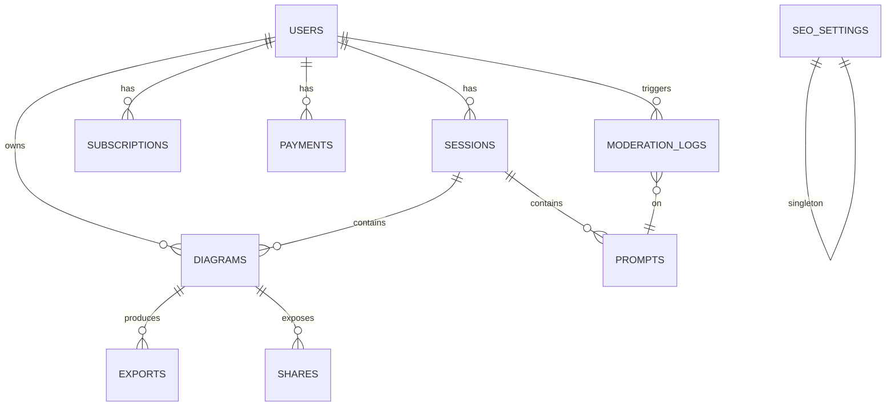

# Diagrammer PRD

## 0) 한눈 요약

* **비회원(게스트)**: LLM → Mermaid/vis.js 리드온리, PNG Export
* **무료 회원**: Mermaid/vis.js → React Flow 변환 편집, 세션 2개 저장, PNG/PPTX
* **유료 회원**: 무제한 세션/검색/공유(뷰), Google Slides Export
* **관리자(Admin)**: 회원/세션/결제/콘텐츠/캐시/SEO/보안 관리 (FastAPI Admin)

렌더링/편집 엔진 규칙

* **Mermaid.js**: 플로우/시퀀스/단순 구조(<100 노드)
* **vis.js**: 네트워크/계층/대규모(>100), 500+ 노드 성능 안전장치
* **회원 편집**: Mermaid/vis.js → **React Flow 객체** 변환 후 편집

---

## 12a) 공유/워크스페이스 UX 고도화(2025-09-28)

### 변경 요약
- 워크스페이스 리비전과 메시지를 태스크 단위로 영속화하여 새로고침 후에도 유지
- 코드 드래프트 적용 시 동일 루트의 대표 버블이 최신 리비전을 가리키도록 매핑 보강
- 질문 버블 삭제 UX 안정화: 팝오버 도망 현상 방지 및 질문-답변 블록 동시 삭제

### 상세 내용
- 영속화 키(로컬 스토리지)
  - `workspace.versions.{taskId}`: 해당 태스크의 전체 코드 리비전 배열
  - `workspace.messages.{taskId}`: 해당 태스크의 채팅 타임라인(질문/답변) 배열
  - 기존 전역 키(`workspace.versions`, `workspace.messages`)도 유지하되, 현재 태스크가 있을 경우 태스크 단위 키를 우선 사용
- 로드/저장 흐름
  - `Workspace.tsx`의 `loadTask()`가 `{taskId}`별 저장본을 우선 복원
  - 메시지/리비전 변경 시 `saveTaskMessages()`에서 태스크 리스트 갱신과 함께 `{taskId}`별 전체 스냅샷을 저장
- 드래프트 적용(`applyDraft`)
  - 적용 버전의 `rootId` 기준으로 타임라인 내 같은 루트의 대표 코드 버블 1개를 찾아 최신 리비전 ID로 교체
  - 적용 후 `selectedVersionId`, `openRootId`, `openRevisionByRoot[rootId]`를 최신으로 동기화
  - 루트별 적용 리비전은 최대 5개만 유지(`pruneRevisions`)
- 삭제 팝오버/동작
  - 질문 버블 액션바에 고정 상태(`actionBarFor`)와 삭제 팝오버 제어 상태(`openDeleteFor`)를 도입해, 마우스가 팝오버로 이동해도 닫히지 않도록 처리
  - 삭제 시 해당 사용자 질문과 그 뒤의 첫 번째 어시스턴트 코드 버블을 함께 제거

### 파일
- 프론트: `apps/web/components/workspace/Workspace.tsx`

### 접근성/UX
- 삭제 확인 팝오버에 명확한 포커스/호버 유지, 키보드 내비 지원(버튼 focusable)
- 코드 리비전 적용 시 즉시 캔버스 반영 및 토스트 안내

## 9) 프론트엔드 UX 업데이트(2025-09-26)

### 개요
- 답변 버블 내 코드 리비전을 ‘동그란 점(최대 5개)’으로 표현하고, 클릭한 리비전만 펼쳐서 캔버스에 즉시 렌더.
- 채팅/캔버스는 세로 풀-높이. 좌우 비율은 스플리터로 조절(기본 30/70)하며, 설정 화면에서 슬라이더로 변경 가능(LocalStorage 연동).
- 오류/예외는 안내형 버블로만 노출(캔버스 렌더 미트리거).

### 상세
- 리비전 관리
  - 루트별 최신 5개 리비전 보관. 초과 시 자동 정리(prune).
  - 오래된 리비전일수록 흐릿하게, 최신은 진하게 표현. 활성 리비전에는 링 표시.
  - 클릭 시 해당 리비전만 펼치고 캔버스 즉시 렌더.

- 레이아웃/조작
  - 좌측 채팅, 우측 캔버스가 h-full.
  - 가운데 수평 스플리터로 20~80% 범위에서 비율 조절.
  - 설정 화면에서 슬라이더로 비율 변경 가능(키: `workspace.splitPct`), 워크스페이스는 storage/커스텀 이벤트로 실시간 반영.

- 버튼/툴팁
  - 캔버스 헤더: PNG, SVG, 이미지 복사, 코드 저장 버튼을 같은 줄에 배치하고, 제목 변경/삭제는 개별 아이콘 버튼으로만 노출(드롭다운 제거).
  - 모든 아이콘 버튼에 툴팁(title/aria-label) 제공.
  - 답변 버블 상단 액션은 편집/복사만 유지.

- 상태 표시
  - 렌더 성공: 초록 테두리, 실패: 빨간 테두리. 히스토리/루트 표시는 제거.

### 비고(기술)
- 프론트: `apps/web/components/workspace/Workspace.tsx`
- 설정: `apps/web/app/settings/page.tsx` (split 비율 설정 + 이벤트 반영)
- 백엔드: `apps/api/llm_adapter.py`(Gemini 후보 모델 폴백 → Mock 폴백, 코드 유효성 휴리스틱)

## 10) 사이드 네비게이션 업데이트(2025-09-26)

### 개요
- Notion 스타일의 왼쪽 고정 사이드 네비게이션을 도입. 화면 전체 높이(h-screen), 상단 로고/이름, 중앙 메뉴, 하단 프로필 구성.
- 데스크톱: 접기/펼치기 토글(지속성 localStorage: `sidebar.collapsed`).
- 모바일: shadcn/ui `Sheet`로 햄버거 버튼 토글.

### 상세
- 파일 구조
  - 서버: `apps/web/components/side-nav/SideNav.tsx`
  - 클라이언트: `apps/web/components/side-nav/SideNavClient.tsx`
  - 레이아웃 통합: `apps/web/app/layout.tsx` 내 `<SideNav />` 적용
  - 모바일 Sheet: `apps/web/components/ui/sheet.tsx`

- 네비게이션/접근성
  - Hover: `hover:bg-[var(--bg-e2)]`
  - Active: `font-semibold + border-l-2 border-[var(--color-primary)] + subtle glow`
  - 키보드 내비: Tab/Enter/Space, `aria-current="page"`, `focus-visible:ring-2`(accent)
  - 접힘 상태: 아이콘만 표시, 라벨은 `sr-only`, 툴팁 대체(브라우저 기본 title) 가능

- 디자인 토큰
  - Tailwind v4 `@theme` 변수 사용: Electric Violet(`--color-primary`), Cyan Azure(`--color-accent`), `--bg-e2`, `--radius`

## 11) Tasks 및 검색 패널(2025-09-26)

### 개요
- 사이드바 메뉴 `Projects` → `Tasks`로 개편. Dashboard 바로 아래에 `New Task`, `Search` 추가.
- `New Task` 클릭 시 새로운 작업이 생성되고 현재 세션이 초기화되며, 작업 목록에 `새작업 N`으로 추가.
- `Search`는 사이드바 오른쪽에 슬라이딩 패널로 표시되며, 모든 작업의 타이틀과 채팅(사용자/어시스턴트) 내용을 대상으로 검색.

### 동작/데이터
- 로컬 스토리지 키
  - `tasks.list`: 작업 배열 `[{ id, title, createdAt, messages }]`
    - messages: `{ role: 'user'|'assistant', content: string }[]`
  - `tasks.currentId`: 현재 선택된 작업 ID
  - `tasks.next`: 새 작업 넘버링 시퀀스
- 이벤트
  - 생성: `window.dispatchEvent(new CustomEvent('tasks:new', { detail: { id } }))`
  - 선택: `window.dispatchEvent(new CustomEvent('tasks:select', { detail: { id } }))`
  - 갱신 브로드캐스트(동일 탭): `window.dispatchEvent(new CustomEvent('tasks:updated'))`

### 구현
- 사이드바(클라이언트): `apps/web/components/side-nav/SideNavClient.tsx`
  - Tasks 리스트 렌더링, `New Task` 생성, `Search` 패널 토글
  - 각 태스크 항목에 드롭다운 액션(이름 바꾸기, 삭제)을 제공하며, 이름 바꾸기는 인라인 입력으로 즉시 수정 가능
  - `tasks:updated` 이벤트 구독으로 동일 탭에서 리스트 즉시 반영
  - 현재 선택된 작업 강조(하이라이트) 및 `/tasks/{id}` 경로에서 상위 `Tasks` 메뉴 활성화 유지
- 워크스페이스: `apps/web/components/workspace/Workspace.tsx`
  - `tasks:new` 수신 시 세션 초기화(메시지/버전/선택 상태)
  - `tasks:select` 수신 시 해당 작업의 messages 로드 → 메시지/버전 간략 재구성 후 타임라인에 반영
  - 메시지 변경 시 `tasks.list`에 간소화된 메시지 스냅샷 저장
  - 작업 제목 인라인 변경(편집/저장/취소) 및 `tasks.list`에 즉시 반영
  - 캔버스 헤더: 타이틀과 액션 버튼을 한 줄 정렬, 본문 영역을 게스트/회원 모드에 맞게 분기(버튼: PNG/SVG/복사/코드/공유)
  - 캔버스 뷰어(게스트 우선 구현): `react-zoom-pan-pinch` 기반 팬/줌, 그리드 배경, PNG/SVG 단일 이미지 감싸기
  - 타임라인: 차트 코드 버블 폭 고정(640px), 버전 점 선택 UI로 교체
- 라우트 스텁: `apps/web/app/tasks/page.tsx` (404 방지 및 가이드)

### 접근성/디자인
- `aria-current="page"` 적용, `focus-visible` 링, 키보드 내비 지원
- 패널: `role="dialog"`/`aria-label="Search"`, 사이드바 폭에 맞춰 좌측 오프셋 적용(접힘 64px/펼침 256px)

## 12) 공유 기능(2025-09-26)

### 개요
- 캔버스 상단 우측에 "공유" 버튼 추가. 현재 선택된 캔버스 코드를 서버에 공유 등록하고, PIN(영숫자 5자리)과 공유 URL(`/s/{id}`)을 발급받음.
- 사이드바 하단에 "공유된 페이지" 섹션을 추가해 로컬에 저장된 공유 링크를 리스트업.
- 공유 페이지는 PIN을 입력해야 열람 가능하며, 우측 상단에 PIN 상태과 공유 URL을 노출.

### 백엔드(API)
- 경로(prefix: `/api/v1`)
  - `POST /share`: 본문 `{ code, engine, title }` → 응답 `{ id, pin, title, created_at }`
  - `GET /share/{id}/meta`: 공유 메타 조회(코드 제외)
  - `POST /share/{id}/unlock`: 본문 `{ pin }` → 검증 후 `{ id, title, engine, code }` 반환
- 영속화: `apps/api/data/shares.json`에 JSON 저장(load/save)

### 프론트엔드
- 워크스페이스: `apps/web/components/workspace/Workspace.tsx`
  - 공유 버튼 클릭 시 `/api/v1/share` 호출 → 로컬 `shared.list`에 `{ id, pin, title, url, createdAt }` 추가, `shared:updated` 이벤트 브로드캐스트
- 공유 페이지: `apps/web/app/s/[id]/page.tsx`
  - 최초 메타 조회 후 PIN 입력 화면 → `unlock` 성공 시 다이어그램 렌더(읽기 전용)
- 사이드바: `apps/web/components/side-nav/SideNavClient.tsx`
  - "공유된 페이지" 섹션에 로컬 저장된 공유 링크 리스트업(같은 탭 업데이트 반영)

### 접근성/보안
- 공유 페이지: PIN 검증 실패 시 403 처리 및 에러 메시지 표시
- 버튼/입력에 적절한 `aria-label`과 포커스 링 적용

## 13) 대시보드 개편(2025-09-26)

### 개요
- 홈(`/`)을 대시보드 화면으로 변경. 작업/다이어그램/공유 통계를 한 눈에 표시.
- 각 Task는 전용 세션 페이지(`/tasks/{id}`)에서 관리되며, 대시보드에서는 채팅 세션을 표시하지 않음.

### 화면 요소
- KPI 카드: 총 작업수, 총 다이어그램수, 공유된 페이지수
- 차트(Recharts): 주제별 다이어그램수(BarChart), 일별 다이어그램수(LineChart)
- 작업별 다이어그램수(최근 10개 작업 BarChart)

### 라우팅/구성
- `/` → `Dashboard` 렌더(`apps/web/components/dashboard/Dashboard.tsx`)
- `/tasks/[id]` → `Workspace` 렌더 + 해당 작업 세션 선택 및 로드
- 사이드바에서 New Task/Task 클릭/검색 결과 클릭 시 `/tasks/{id}`로 이동

### 구현 세부사항
- `Dashboard.tsx`: Recharts(`BarChart`, `LineChart`, `ResponsiveContainer`) 기반으로 데이터 시각화, 로컬 저장소에서 통계 로드
- 데이터 없음 시 빈 상태 메시지 표시, 축/툴팁 스타일 Tailwind 토큰과 일치

## 14) 캔버스 아키텍처 재정립(2025-09-27)

### 전략 요약
- **게스트 뷰(리드온리)**: `react-zoom-pan-pinch`로 PNG/SVG 단일 이미지를 감싸 팬/줌 제공. `html-to-image` 기반 PNG 캡처, 필요 시 백엔드 SVG 생성 대응.
- **회원 편집/저장**: `React Flow(=XYFlow)`를 유일한 편집 엔진으로 채택. Mermaid/vis.js 코드는 입력 포맷으로만 사용하고 변환 후 RF JSON으로 저장/편집.
- **대규모 그래프 (>500 노드)**: `vis-network` 전용 리드온리 뷰어. 편집 요청 시 클러스터링/샘플링 후 RF로 다운사이즈 변환.
- **내보내기**: RF JSON을 단일 소스로 삼아 이미지 복사/PNG(클라이언트), PPTX(`python-pptx`), Google Slides(Slides API)로 변환. "Copy as" UX로 Image/PPTX/Slides 3옵션 제공.

### 렌더 파이프라인
- 게스트: `Mermaid/vis.js → SVG/Canvas → PNG` → `<TransformWrapper>` 래핑.
- 회원: `mermaid → RF JSON`, `vis.js → RF JSON` 변환기 도입(서버 우선).
- 대규모: 기본 `vis-network` 리드온리, 편집 시 서브그래프 추출.

### 내보내기 세부
- **이미지**: 클라이언트 `toBlob()` → Clipboard + 다운로드.
- **PPTX**: 백엔드 `RF JSON → python-pptx` (좌표 스케일링, 스타일 매핑).
- **Slides**: 백엔드 `RF JSON → presentations.batchUpdate` (shape/connector 생성, zIndex 정렬).
- 실행 히스토리에 내보내기 옵션 메타 기록.

### 구현 단계
1. 게스트 MVP: Mermaid/vis.js → PNG/SVG, `react-zoom-pan-pinch` 팬/줌, PNG Export.
2. 무료: 변환기 + React Flow 편집 + 세션 2개 제한 + PPTX Export.
3. 유료: 검색/Slides Export/공유 링크.
4. Admin: FastAPI Admin + 모더레이션/로그/SEO/캐시.

### 리스크/보강
- Mermaid/vis.js 스타일 → RF 스타일 토큰 맵 유지, 텍스트 래핑 보정, 커넥터 라우팅 모드 통일.
- RF 월드 좌표 vs 출력 매체 좌표 변환 상수 정의.

## 15) 고급 워크스페이스 기능(2025-09-28)

### 워크스페이스 리비전 시스템
- **태스크별 영속화**: 각 태스크의 코드 리비전과 채팅 메시지를 로컬 스토리지에 개별 저장
  - `workspace.versions.{taskId}`: 해당 태스크의 전체 코드 리비전 배열
  - `workspace.messages.{taskId}`: 해당 태스크의 채팅 타임라인(질문/답변) 배열
- **드래프트 적용**: 코드 편집 시 동일 루트의 대표 버블이 최신 리비전을 가리키도록 매핑
  - 적용 후 `selectedVersionId`, `openRootId`, `openRevisionByRoot[rootId]`를 최신으로 동기화
  - 루트별 적용 리비전은 최대 5개만 유지(`pruneRevisions`)
- **질문-답변 블록 삭제**: 질문 버블과 그 뒤의 첫 번째 어시스턴트 코드 버블을 함께 제거
  - 삭제 팝오버 고정 상태(`actionBarFor`)와 제어 상태(`openDeleteFor`)로 마우스 이동 시에도 유지

### 실시간 프리뷰 시스템
- **라이브 프리뷰**: 코드 편집 시 캔버스에 즉시 반영되는 실시간 렌더링
  - `livePreviewCode`, `livePreviewEngine` 상태로 드래프트 편집 시 캔버스 실시간 렌더링
  - 편집 중인 코드와 엔진 타입을 실시간으로 반영

### Graphviz DOT 지원
- **자동 감지**: Mermaid 코드에서 Graphviz DOT 문법 자동 감지
  - `looksLikeGraphviz()` 함수로 DOT 문법 패턴 인식
  - `digraph G { ... }` 형태의 DOT 코드를 vis.js로 자동 변환
- **파서 구현**: DOT 문법을 vis.js 네트워크 데이터로 변환
  - `parseGraphvizDot()` 함수로 노드/엣지 추출
  - 라벨 매핑, ID 생성, 원형 배치 알고리즘 적용

### 고급 캔버스 기능
- **외부 리소스 인라인화**: SVG 내 외부 이미지/스타일시트를 데이터 URL로 변환
  - `inlineExternalResources()` 함수로 외부 참조 제거
  - 캔버스 오염 방지를 위한 CORS 처리 및 투명 픽셀 대체
- **투명 배경 지원**: PNG 내보내기 시 투명 배경 유지
  - 배경 사각형 자동 제거, 투명도 지원 PNG 생성
  - 노드 배경과 전체 배경 구분 로직

### 검색 및 내비게이션
- **태스크 검색**: 사이드바 슬라이딩 패널에서 모든 작업의 타이틀과 채팅 내용 검색
  - 실시간 검색, 하이라이트, 검색 결과 클릭 시 해당 태스크로 이동
- **접근성 강화**: ARIA 레이블, 키보드 내비게이션, 포커스 관리
  - `aria-current="page"`, `focus-visible` 링, 스크린 리더 지원

### 설정 및 커스터마이징
- **워크스페이스 분할**: 채팅/캔버스 비율을 20~80% 범위에서 조절
  - 설정 페이지에서 슬라이더로 변경, LocalStorage 연동
  - 실시간 반영을 위한 커스텀 이벤트 시스템


## 1) 화면·메뉴 체계 (재확인)

### 1.1 사용자 메뉴 (요약)

* **게스트**: 홈, 다이어그램(리드온리), PNG, 로그인/가입
* **무료**: 홈, 세션(최대2), React Flow 편집, PNG/PPTX, 설정
* **유료**: 홈, 세션(무제한/검색), React Flow 고급, PNG/PPTX/Slides, 공유, 설정

### 1.2 Admin 메뉴 (요약)

* 대시보드, 회원, 세션, 결제, 콘텐츠(비속어/신고), 캐시/성능, SEO, 보안/로그

---

## 2) 접근성·반응형·설정

* **모바일/태블릿**: 탭 전환(입력/코드/히스토리 ↔ 뷰), 유료 Export/공유는 Bottom Sheet
* **접근성**: ARIA, 컬러블라인드 팔레트, Export 시 **대체 텍스트(프롬프트 요약)** 삽입
* **설정 페이지**: LLM 선택(Gemini/Local), 언어/통화(i18n/CURRENCY), 스타일 프리셋, 접근성 옵션
* **프로필**: 사용자 정보/구독/결제 상태

---

## 3) 기술 스택·라이브러리

* **프론트**: Next.js(App Router), React Flow, Mermaid.js, vis-network, shadcn/ui(+Radix), Tailwind, DaisyUI/MagicUI/Aceternity UI, Tailwind Variants
* **백엔드**: FastAPI, FastAPI-Users(또는 자체 OAuth2/JWT), FastAPI Admin, SQLAlchemy+Alembic, Redis, Celery
* **DB**: PostgreSQL(JSONB), (선택) ElasticSearch
* **인증/결제/SEO/분석**: Auth.js, Stripe/토스, next-seo, next-sitemap, umami/Plausible
* **Export**: html-to-image, python-pptx, Google Slides API
* **콘텐츠 안전**: profanity-check / Perspective API

---

## 4) 단계별 개발 로드맵 + DB 스키마 초안

> 마이그레이션은 **단계별 추가** 중심으로 설계. 스키마 변경은 최소화하고, JSONB로 유연성 확보.

### 단계 1: **코어(MVP)** – 게스트 체험 (약 3주)

**기능**

* 프롬프트 → LLM → Mermaid/vis.js 리드온리 렌더링
* PNG Export
* 반응형 레이아웃

**핵심 테이블**

```sql
-- visitors: 익명(비회원) 세션 추적(쿠키/디바이스 핑거프린트)
CREATE TABLE visitors (
  id BIGSERIAL PRIMARY KEY,
  anon_id TEXT UNIQUE NOT NULL,
  created_at TIMESTAMPTZ DEFAULT now()
);

-- diagrams: 다이어그램 원천 코드 + 메타 (게스트도 저장 가능: TTL 캐시성 보관)
CREATE TABLE diagrams (
  id BIGSERIAL PRIMARY KEY,
  visitor_id BIGINT REFERENCES visitors(id) ON DELETE SET NULL,
  engine TEXT CHECK (engine IN ('mermaid','visjs')) NOT NULL,
  code TEXT NOT NULL,
  render_type TEXT CHECK (render_type IN ('readonly')) DEFAULT 'readonly',
  prompt TEXT,
  meta JSONB DEFAULT '{}'::jsonb,            -- node/edge count, layout hints 등
  ttl_expire_at TIMESTAMPTZ,                 -- 게스트 보관 만료
  created_at TIMESTAMPTZ DEFAULT now()
);

-- exports: PNG 결과 이력(필요 시 S3 key만 저장)
CREATE TABLE exports (
  id BIGSERIAL PRIMARY KEY,
  diagram_id BIGINT REFERENCES diagrams(id) ON DELETE CASCADE,
  format TEXT CHECK (format IN ('png')) NOT NULL,
  storage_key TEXT,                          -- 파일 경로/키
  created_at TIMESTAMPTZ DEFAULT now()
);

CREATE INDEX ON diagrams USING GIN (meta);
```

**비고**

* 게스트 데이터는 TTL 만료(예: 24\~72시간). 정식 회원 전환 시 승격(마이그레이션) 가능.

---

### 단계 2: **무료 회원** (약 5주)

**기능**

* Auth(로그인/가입)
* Mermaid/vis.js → **React Flow 객체** 변환 후 편집
* **세션 2개** 저장(코드+프롬프트 히스토리)
* PPTX Export
* 프로필/설정 페이지

**추가/변경 테이블**

```sql
-- users: 기본 회원
CREATE TABLE users (
  id BIGSERIAL PRIMARY KEY,
  email CITEXT UNIQUE NOT NULL,
  password_hash TEXT,                        -- 소셜 로그인만 쓸 경우 NULL 허용
  name TEXT,
  locale TEXT DEFAULT 'ko',
  currency TEXT DEFAULT 'KRW',
  role TEXT CHECK (role IN ('user','admin')) DEFAULT 'user',
  created_at TIMESTAMPTZ DEFAULT now(),
  updated_at TIMESTAMPTZ DEFAULT now()
);

-- sessions: 사용자별 작업 단위(히스토리+다이어그램 묶음)
CREATE TABLE sessions (
  id BIGSERIAL PRIMARY KEY,
  user_id BIGINT REFERENCES users(id) ON DELETE CASCADE,
  title TEXT,
  status TEXT CHECK (status IN ('active','archived')) DEFAULT 'active',
  created_at TIMESTAMPTZ DEFAULT now(),
  updated_at TIMESTAMPTZ DEFAULT now()
);

-- prompts: 프롬프트 히스토리
CREATE TABLE prompts (
  id BIGSERIAL PRIMARY KEY,
  session_id BIGINT REFERENCES sessions(id) ON DELETE CASCADE,
  content TEXT NOT NULL,
  llm_provider TEXT,                         -- 'gemini' | 'local' 등
  llm_params JSONB DEFAULT '{}'::jsonb,
  created_at TIMESTAMPTZ DEFAULT now()
);

-- diagrams (확장): 회원 소유, 편집 지원
ALTER TABLE diagrams
  ADD COLUMN user_id BIGINT REFERENCES users(id) ON DELETE SET NULL,
  ADD COLUMN session_id BIGINT REFERENCES sessions(id) ON DELETE CASCADE,
  ADD COLUMN render_type TEXT CHECK (render_type IN ('readonly','reactflow')) DEFAULT 'readonly',
  ADD COLUMN rf_graph JSONB;                 -- React Flow 객체 그래프(회원 편집용)

-- exports 확장: PPTX 지원
ALTER TABLE exports
  ADD COLUMN format TEXT CHECK (format IN ('png','pptx')) NOT NULL;
```

**비즈니스 로직**

* **세션 수 제한(2개)**: 애플리케이션 레벨 + DB 제약(트리거)로 이중 방어 가능
* 변환 파이프라인: `code (mermaid/visjs) → rf_graph(JSONB)` 저장

---

### 단계 3: **유료 회원** (약 6주)

**기능**

* **무제한 세션** 저장
* **검색**(프롬프트/코드/노드 라벨)
* Google Slides Export
* **공유 링크(뷰 전용)** + CTA
* Stripe/토스 구독 연동

**추가/변경 테이블**

```sql
-- subscriptions: 구독 상태
CREATE TABLE subscriptions (
  id BIGSERIAL PRIMARY KEY,
  user_id BIGINT REFERENCES users(id) ON DELETE CASCADE,
  provider TEXT CHECK (provider IN ('stripe','toss')) NOT NULL,
  plan TEXT CHECK (plan IN ('free','pro')) NOT NULL,
  status TEXT CHECK (status IN ('active','canceled','past_due')) NOT NULL,
  current_period_end TIMESTAMPTZ,
  created_at TIMESTAMPTZ DEFAULT now(),
  updated_at TIMESTAMPTZ DEFAULT now()
);

-- invoices/payments: 결제 이력(간략)
CREATE TABLE payments (
  id BIGSERIAL PRIMARY KEY,
  user_id BIGINT REFERENCES users(id) ON DELETE CASCADE,
  provider TEXT, external_id TEXT, amount_cents INT, currency TEXT,
  status TEXT, paid_at TIMESTAMPTZ, created_at TIMESTAMPTZ DEFAULT now()
);

-- shares: 공유 링크(뷰 전용)
CREATE TABLE shares (
  id BIGSERIAL PRIMARY KEY,
  diagram_id BIGINT REFERENCES diagrams(id) ON DELETE CASCADE,
  token TEXT UNIQUE NOT NULL,                -- URL 토큰
  expire_at TIMESTAMPTZ,
  created_at TIMESTAMPTZ DEFAULT now()
);

-- exports 확장: Google Slides
ALTER TABLE exports
  ADD COLUMN format TEXT CHECK (format IN ('png','pptx','gslides')) NOT NULL;

-- 검색 최적화 인덱스 (Postgres FTS + json path)
CREATE MATERIALIZED VIEW search_index AS
SELECT
  d.id AS diagram_id,
  d.user_id,
  setweight(to_tsvector('simple', coalesce(d.prompt,'')), 'B') ||
  setweight(to_tsvector('simple', coalesce(d.code,'')), 'A') AS tsv
FROM diagrams d;

CREATE INDEX ON search_index USING GIN (tsv);
```

**비즈니스 로직**

* 검색은 **유료 전용** 활성화
* 공유 링크는 **Mermaid/vis.js 리드온리 뷰**에 맞춰 성능/보안 최적화

---

### 단계 4: **Admin 패널** (약 4주)

**기능**

* 회원/세션/결제/콘텐츠/캐시/SEO/보안/로그 관리
* 관리자 MFA

**추가/변경 테이블**

```sql
-- moderation: 비속어/혐오 로그 & 신고 처리
CREATE TABLE moderation_logs (
  id BIGSERIAL PRIMARY KEY,
  user_id BIGINT REFERENCES users(id) ON DELETE SET NULL,
  session_id BIGINT REFERENCES sessions(id) ON DELETE SET NULL,
  prompt_id BIGINT REFERENCES prompts(id) ON DELETE SET NULL,
  type TEXT CHECK (type IN ('profanity','hate','report')) NOT NULL,
  raw_text TEXT NOT NULL,
  score JSONB,                               -- API 응답 점수
  action TEXT CHECK (action IN ('none','warn','delete','ban')) DEFAULT 'none',
  created_at TIMESTAMPTZ DEFAULT now()
);

-- system_logs: API/에러/LLM 호출 로그 (샤딩/보존기간 정책 권장)
CREATE TABLE system_logs (
  id BIGSERIAL PRIMARY KEY,
  level TEXT CHECK (level IN ('INFO','WARN','ERROR')) NOT NULL,
  source TEXT,                                -- 'llm','export','auth','admin' 등
  message TEXT,
  context JSONB,
  created_at TIMESTAMPTZ DEFAULT now()
);

-- seo_settings: 전역 SEO 설정
CREATE TABLE seo_settings (
  id SMALLINT PRIMARY KEY DEFAULT 1,
  meta JSONB NOT NULL,                       -- title, og, default desc 등
  robots TEXT,
  sitemap_url TEXT,
  hreflang JSONB,
  updated_at TIMESTAMPTZ DEFAULT now()
);

-- cache_admin: 캐시/성능 관리 스냅샷
CREATE TABLE cache_admin (
  id BIGSERIAL PRIMARY KEY,
  kind TEXT,                                  -- 'redis','llm_quota'
  metrics JSONB,
  created_at TIMESTAMPTZ DEFAULT now()
);
```

**운영**

* **FastAPI Admin**으로 users/sessions/diagrams/prompts/exports/subscriptions/payments/moderation\_logs/system\_logs/seo\_settings 조작
* Redis 초기화, LLM 에러 모니터링, 신고 처리 워크플로

---

## 5) ER 개요 다이어그램 (Mermaid)



---

## 6) 인덱싱·성능·보안 정책(요약)

* **인덱스**: `diagrams(meta JSONB GIN)`, `search_index(tsv GIN)`, FK 인덱스
* **보존**: 게스트 TTL 만료, system\_logs 보존기간(예: 30\~90일), exports 파일 수명 정책
* **성능**: 500+ 노드 vis.js fallback, React Flow 캔버스 가상화 옵션, Celery로 Export/Slides 비동기 처리
* **보안**: 전 구간 HTTPS, JWT(짧은 수명) + Refresh, 관리자 MFA, 공유 토큰 만료

---

## 7) QA·릴리즈 전략

* **단계별 e2e 테스트**: 게스트 → 무료 → 유료 → Admin
* **마이그레이션**: Alembic 단계별 스크립트, 다운그레이드 경로 확인
* **롤백**: 주요 테이블 백업 스냅샷, 피처 플래그로 점진 오픈

---

